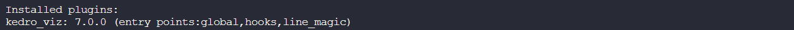
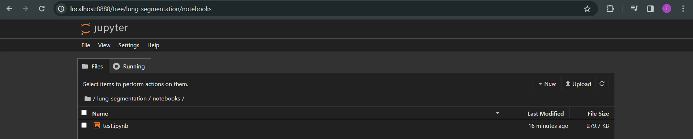
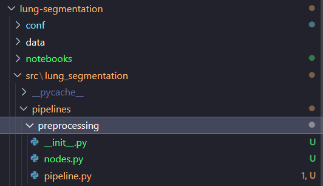
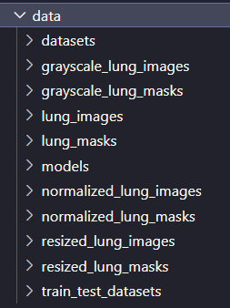
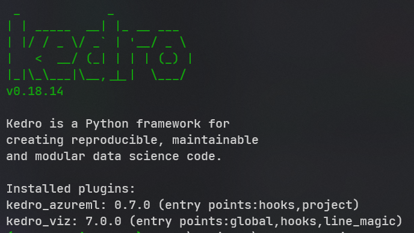
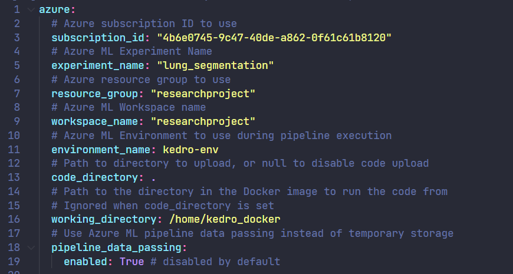

# Research Project

**Onderzoeksvraag:** _Hoe kan je met Kedro een autoencoder pipeline opzetten en deployen naar verschillende cloud providers?_

### Kedro installatie

https://docs.kedro.org/en/stable/get_started/install.html#create-a-virtual-environment-for-your-kedro-project:~:text=Click%20to%20expand%20instructions%20for%20venv

```bash
python -m venv kedro-environment
.\kedro-environment\Scripts\activate
pip install kedro
kedro info
```

### Kedro project aanmaken

https://docs.kedro.org/en/stable/get_started/new_project.html#introducing-kedro-new:~:text=Edit%20on%20GitHub-,Create%20a%20new%20Kedro%20project,-%C2%B6

```bash
kedro new --name="Lung Segmentation" --tools="5,7" --example="no"
```

### Kedro-Viz installatie

https://docs.kedro.org/en/stable/get_started/new_project.html#project-tools:~:text=this%20question%20again.-,Visualise%20a%20Kedro%20project,-%C2%B6

```bash
pip install kedro-viz
```



## Kedro & Jupyter Notebook

https://youtu.be/3q2RNWLibyY?list=PL-JJgymPjK5LddZXbIzp9LWurkLGgB-nY

```bash
pip install notebook
jupyter notebook
```



## Pipeline aanmaken

https://docs.kedro.org/en/0.18.4/tutorial/create_a_pipeline.html#:~:text=Generate%20a%20new%20pipeline%20template

> [!CAUTION]<br/>
> Error: No such command 'pipeline'.<br/>
> Fix -> Je moet in de juiste projectfolder zitten vooraleer je de pipeline aanmaakt via de CLI (zie cd-commando).<br/>

```bash
cd ./lung-segmentation
kedro pipeline create preprocessing
```



## Pipeline runnen & visualiseren

```bash
kedro run
kedro viz run
```



## Deployment naar AzureML

```bash
python -m venv kedro-azure-environment
.\kedro-azure-environment\Scripts\activate
pip install --upgrade pip
pip install kedro-azureml
kedro info
```



## Deployment naar AzureML

### Environment aanmaken

https://kedro-azureml.readthedocs.io/en/0.7.0/source/03_quickstart.html#option-2-code-upload-flow

> [!NOTE]<br/>
> Benodigdheden: Azure CLI met AzureML plugin, Docker, AzureML workspace met Azure Container Registry

```bash
pip install kedro-docker
kedro docker build --docker-args "--build-arg=BASE_IMAGE=python:3.9-slim" --image=YOUR_REGISTRY_HERE.azurecr.io/kedro-base-image:latest
az acr login --name YOUR_REGISTRY_HERE
docker push YOUR_REGISTRY_HERE.azurecr.io/kedro-base-image:latest
az ml environment create --name "YOUR_REGISTRY_HERE" --image "YOUR_REGISTRY_HERE.azurecr.io/kedro-base-image:latest" -w "YOUR_WORKSPACE_NAME" -g "YOUR_RESOURCE_GROUP"
```

### AzureML credentials definiëren

> [!NOTE]<br/>
> Benodigdheden: AzureML workspace, Environment

```bash
kedro azureml init \
--aml_env=kedro-base-image@latest \
YOUR_SUBSCRIPTION_ID \
YOUR_RESOURCE_GROUP \
YOUR_WORKSPACE_NAME \
"lung_segmentation" \
YOUR_CLUSTER_NAME \
```



### Kedro pipeline inpakken als Azure YAML

> [!WARNING]<br/>
> Onderstaande commando bestaat ook maar werkt niet of kan vreemd gedrag vertonen: <br/>
> kedro azureml run

```bash
kedro azureml compile
az ml pipeline create \
--name "lung-segmentation" \
--pipeline-yaml "pipeline.yaml" \
--workspace-name "YOUR_WORKSPACE_NAME" \
--resource-group "YOUR_RESOURCE_GROUP"
```

> [!CAUTION]<br/> > https://github.com/Azure/MachineLearningNotebooks/issues/1677
